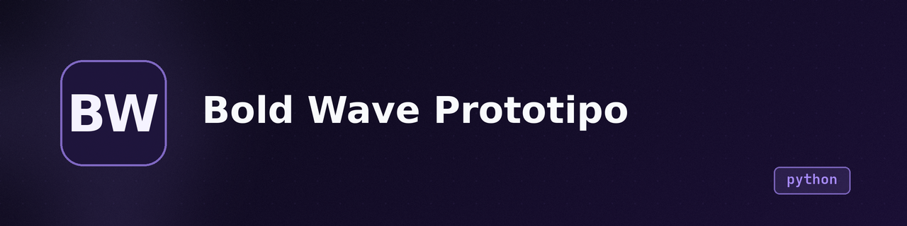

<p align="center">
  
</p>

<h1 align="center">Bold Wave</h1>

<p align="center"><b>Django website prototype for a digital marketing agency. Student project, not production-ready.</b></p>

<p align="center">
  
  
  
  
  
</p>

---

## What is it

A multi-page website for "Bold Wave," a fictional digital marketing agency. Built as a university project with Django. Provides a landing page, an "About Us" section with image carousel, a contact form that sends email, and a basic login page that does not actually authenticate.

**In one sentence:** A Django 5.2 prototype of a marketing agency site with contact email and a non-functional login.

## State

| | |
|---|---|
| **State** | Prototype / unfinished |
| **Last activity** | 2025-05 |
| **Can it be used today** | No — login does not work, email goes to console only, no auth, no user model |
| **What's missing** | Authentication (no user model), real email delivery, registration page, requirements.txt, .env for secrets, tests |
| **Known issues / debt** | Hardcoded Django secret key, `DEBUG=False` with `ALLOWED_HOSTS=["*"]`, login form password field is plain text, contact form renders duplicate HTML fields alongside Django form |

## Why it exists

University group project (Denise Agüero, Paola Irigoitia, Gabriel Solotorevsky, Salvador Avalos). The goal was to build a website for a digital marketing agency as part of coursework. The project reached a basic working state (pages render, contact form sends to console) but was not completed — the login feature was attempted but does not function.

## Demo

No live demo available. The project has no deployment configuration.

## Installation and usage

Requirements: Python 3.10+, pip, virtualenv.

```bash
git clone https://github.com/Gonanf/bold_wave_prototipo.git
cd bold_wave_prototipo
python3 -m venv venv
source venv/bin/activate
pip install django  # no requirements.txt exists
python manage.py migrate
python manage.py runserver
```

```bash
# Contact form sends email to console (no real SMTP)
# Visit http://127.0.0.1:8000/
```

The `runserver.sh` script uses gunicorn on port 3000 but expects the venv to be at `../venv/`.

## Stack

- **Language / runtime:** Python 3, Django 5.2
- **Database:** SQLite (development default)
- **Frontend:** Bootstrap 5.3 (CDN + bundled alpha), custom CSS
- **Email:** Django console backend (development only)

## Architecture

```
bold_wave/       # Django project config (settings, URLs, WSGI)
pages/           # Single app: views, forms (models.py has forms, not models), templates, static
  templates/     # index, nosotros, contactos, sesion — 4 pages, all extend index.html
  static/        # Bootstrap dist + index CSS + images + video
```

No database models are defined. `pages/models.py` contains Django `Form` classes (`Contacto`, `Login`), not `Model` classes. The project has zero database tables beyond Django's built-in auth/sessions (unmigrated).

## Repo structure

```
bold_wave/        # Django project settings, URLs, ASGI/WSGI
pages/            # The single app: views, forms, templates, static files
  templates/      # 4 HTML templates (index, nosotros, contactos, sesion)
  static/         # Bootstrap 5.3 dist, CSS, images, video
docs/             # Auto-generated overview (not maintained)
manage.py         # Django management CLI
runserver.sh      # Gunicorn launcher (expects ../venv/)
db.sqlite3        # SQLite database (empty/default)
```

## Roadmap

- [ ] Implement actual authentication (Django auth, user model, sessions)
- [ ] Fix login page (password field is plain text, no validation)
- [ ] Add registration page (button exists in template but goes nowhere)
- [ ] Set up real email delivery (replace console backend with SMTP)
- [ ] Create requirements.txt
- [ ] Move secrets to .env (SECRET_KEY, email credentials)
- [ ] Add database models if needed (currently zero custom models)

## Notes and decisions

- **Forms in models.py**: `pages/models.py` defines `Contacto` and `Login` as `forms.Form` subclasses, not Django models. This is unconventional — forms and models serve different purposes. Works but should be separated into a `forms.py`.
- **Bootstrap versions**: The project bundles Bootstrap 5.3.0-alpha3 locally but loads 5.3.3 and 5.3.6 from CDN in templates. The local copy is unused.
- **`DEBUG=False` with `ALLOWED_HOSTS=["*"]`**: This is the opposite of secure — debug off means no error details, but wildcard hosts means any domain works. Development should use `DEBUG=True`.
- **Hardcoded secret key**: The Django `SECRET_KEY` is committed in `settings.py`. Must be rotated and moved to environment variables before any real deployment.
- **Contact form duplication**: The contact template renders both `{{ form }}` (Django form fields) and manual HTML `<input>` fields, resulting in duplicate fields in the browser.

## License

Private — no license file. Not open source.
